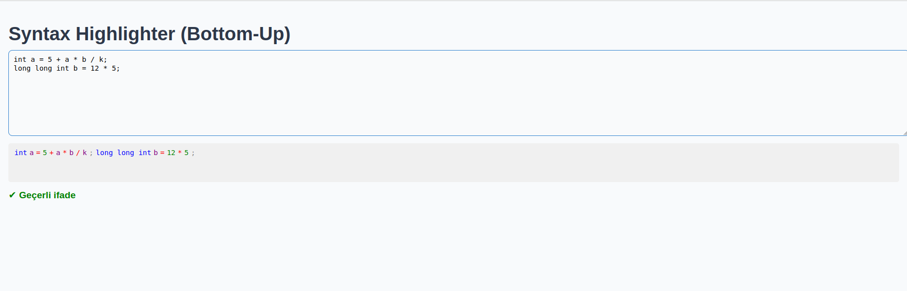

# 🧠 Real-Time Grammar-Based Syntax Highlighter

C benzeri ifadeleri tanıyabilen, gerçek zamanlı çalışan bir **Syntax Highlighter + Bottom-Up Parser**. 

## 🚀 Özellikler

- Tokenization (kelime türlerine ayırma)
- Bottom-Up Parsing (Shift-Reduce)
- Gerçek zamanlı sözdizimi kontrolü
- Hatalı karakter uyarıları (lexer hatası)
- React tabanlı arayüz

## 📦 Kurulum

```bash
git clone https://github.com/hiddenoob/syntax-highlighter.git
cd syntax-highlighter
npm install
npm run start
````

> Tarayıcıda `http://localhost:3000` adresinden çalışır.

## ✍️ Kullanım

Kod kutusuna C benzeri bir ifade yazın:

```c
int x = (3 + 2) * 5;
```

* ✅ Geçerliyse: "Valid Statement" mesajı çıkar.
* ❌ Hatalıysa: "Invalid Statement" uyarısı çıkar.
* 🚫 Tanımsız karakter girerseniz: lexer hatası yazdırılır.

## 📸 Ekran Görüntüsü



## 🔍 Dil Kuralları

Desteklenen dil kuralları:

* `stmt → keyword identifier = expr ;`
* `expr → number | identifier | ( expr ) | expr operator expr`
* `stmt → stmt stmt` (çoklu satır desteği)

### Dil ve Dilbilgisi Seçimi

Bu proje, C benzeri temel programlama dilinin alt kümesini analiz etmek için tasarlanmıştır. Desteklenen veri tipleri arasında signed/unsigned integer türleri ve floating point türleri yer alır. Dilin söz dizimi basit atama ve aritmetik ifadeleri içerir.

### Sözdizimi Analiz Süreci

Girilen kaynak kod, önce tokenize edilip belirli token tiplerine ayrılır. Ardından bottom-up (shift-reduce) ayrıştırma yöntemi kullanılarak sentaks doğrulaması yapılır. Yığın (stack) yapısı kullanılarak, dil kuralları temelinde ifadeler azaltılır (reduction).

### Sözcüksel (Lexical) Analiz Detayları

Lexical analizde, anahtar kelimeler (örneğin `int`, `signed int`), sayılar, tanımlayıcılar, operatörler ve noktalama işaretleri regex kullanılarak belirlenir. Boşluk karakterleri token olarak alınmaz. Tanınmayan karakterlerde hata fırlatılır.

### Ayrıştırma Yöntemi

Shift-reduce (bottom-up) parser kullanılır. Yığındaki semboller kurallara göre azaltılır. Örneğin:

* `stmt → keyword identifier operator expr punctuation`
* `expr → number | identifier | expr operator expr | ( expr )`
  Parser, dilin temel sözdizimi yapısına uygun ifadeleri tanır ve geçerli ya da geçersiz olarak işaretler.

### Vurgulama Şeması

Token türlerine göre farklı renkler atanır:

* Keyword: Mavi
* Number: Yeşil
* Identifier: Mor
* Operator: Kırmızı
* Punctuation: Gri

### GUI Uygulaması

React ile basit bir kullanıcı arayüzü hazırlanmıştır. Kullanıcı kod yazarken gerçek zamanlı olarak tokenlar renklendirilir ve sentaks geçerliliği gösterilir. Hata durumları ve validite durumu ekranda anında güncellenir.

---

## 📁 Proje Yapısı

```bash
src/
├── App.tsx               # Ana bileşen
├── SyntaxHighlighter.tsx # Tokenizer + Parser + Highlight
└── styles.css
```